# 📘 BAB IV: ANALISIS DAN PERANCANGAN SISTEM
## Sistem Pemesanan Online Ayam Penyet Al-Barokah

Bab ini membahas tentang tahap analisis dan perancangan sistem terhadap Sistem Pemesanan Online Ayam Penyet Al-Barokah. Proses ini merupakan langkah awal yang krusial sebelum tahap penulisan kode program dimulai, guna memahami model bisnis, kebutuhan pengguna, serta memetakan struktur arsitektur data dan alur kerja aplikasi secara komprehensif. Seluruh tabel di dalam dokumen ini menggunakan format **Word-Ready** (dapat disalin dan ditempel langsung ke Microsoft Word secara rapi).

---

## 🏢 4.1 GAMBARAN OBJEK PENELITIAN

Objek penelitian ini berfokus pada **Warung Ayam Penyet Al-Barokah**, sebuah usaha kuliner lokal yang menyajikan menu utama ayam penyet (ayam goreng bumbu tradisional yang dimemarkan di atas cobek sambal pedas) beserta ragam hidangan pendukung seperti bebek penyet, lele penyet, tahu tempe, nasi goreng, aneka es, jus, serta camilan tradisional.

Saat ini, Warung Ayam Penyet Al-Barokah beroperasi secara konvensional melalui outlet fisik. Manajemen outlet melayani transaksi makan di tempat (*dine-in*), bawa pulang (*take-away*), serta pengantaran pesanan (*delivery*) secara lokal. Dengan meningkatnya jumlah pesanan harian dan tuntutan efisiensi operasional, diperlukan transformasi digital melalui penyediaan sistem informasi pemesanan makanan berbasis web dinamis untuk mempercepat pemrosesan pesanan, menekan tingkat kesalahan pencatatan transaksi, serta mengotomatiskan rekapitulasi pelaporan penjualan.

---

## 📝 4.2 ANALISIS SISTEM YANG BERJALAN

Berdasarkan hasil observasi langsung terhadap alur bisnis yang sedang berjalan di Warung Ayam Penyet Al-Barokah, didapatkan fakta bahwa seluruh operasional pelayanan dan administrasi transaksi saat ini masih berjalan secara manual.

Prosedur pemesanan makanan yang sedang berjalan diidentifikasi sebagai berikut:
1. **Penerimaan Pesanan:** Pelanggan yang datang ke outlet harus memesan secara langsung dengan mendiktekan menu pilihan kepada pramusaji, atau memesan dari jarak jauh dengan mengirimkan pesan teks melalui aplikasi WhatsApp.
2. **Pencatatan Pesanan:** Pramusaji menuliskan rincian pesanan secara manual menggunakan pulpen pada lembaran nota kertas fisik rangkap dua.
3. **Pengolahan Makanan:** Pramusaji menyerahkan satu salinan kertas nota fisik tersebut ke bagian dapur untuk mulai diolah oleh juru masak.
4. **Pembayaran Manual:** Pelanggan membayar tagihan secara tunai di kasir, atau melakukan transfer bank secara non-tunai kemudian menunjukkan tangkapan layar (*screenshot*) bukti transfer dari aplikasi m-banking mereka kepada kasir.
5. **Verifikasi Keuangan:** Kasir harus melakukan pengecekan saldo rekening bank Warung secara manual melalui internet banking untuk memastikan dana transfer dari pelanggan telah benar-benar masuk.
6. **Rekapitulasi Laporan:** Pada akhir jam operasional outlet, kasir mengumpulkan seluruh potongan nota kertas transaksi fisik harian, menjumlahkan total nominal uang menggunakan kalkulator, dan mencatat rekapitulasi omzet bersih ke dalam buku kas besar (ledger book) outlet.

Alur manual di atas menimbulkan sejumlah masalah operasional, antara lain:
* **Risiko Kesalahan Pencatatan:** Sering terjadi salah paham pembacaan tulisan tangan pramusaji pada nota kertas oleh juru masak dapur, sehingga makanan yang disajikan tidak sesuai dengan pesanan pelanggan.
* **Kehilangan Data Transaksi:** Nota kertas fisik sangat rentan robek, basah terkena air/kuah makanan, hilang, atau terselip, yang berakibat pada selisih perhitungan omzet keuangan saat penutupan kas.
* **Proses Verifikasi Lambat:** Verifikasi bukti transfer m-banking secara manual memakan waktu cukup lama dan mengganggu antrean di kasir, terutama saat jam sibuk (*peak hours*).
* **Rekapitulasi Laporan Tidak Efektif:** Pemilik warung mengalami kesulitan memantau performa penjualan secara cepat karena rekapitulasi omzet mingguan atau bulanan harus dihitung manual satu per satu dari tumpukan nota kertas.

---

## ⚙️ 4.3 ANALISIS KEBUTUHAN SISTEM

Analisis kebutuhan sistem bertujuan untuk mengidentifikasi fungsionalitas dan kualitas performa apa saja yang wajib dimiliki oleh aplikasi agar dapat memecahkan masalah operasional yang dihadapi oleh objek penelitian.

Kebutuhan sistem dibagi menjadi dua kategori, yaitu kebutuhan fungsional (*functional requirements*) dan kebutuhan non-fungsional (*non-functional requirements*).

### 4.3.1 Analisis Kebutuhan Fungsional
Kebutuhan fungsional mendefinisikan kapabilitas aksi dan pengolahan data yang disediakan oleh sistem informasi untuk masing-masing aktor pengguna:

#### 1. Hak Akses Aktor: Pelanggan (Customer/Guest)
* **Lihat Katalog Menu:** Pelanggan dapat menjelajahi seluruh menu aktif (makanan, minuman, paket, cemilan) lengkap dengan gambar, deskripsi, harga, dan ketersediaan stok secara dinamis.
* **Kelola Keranjang Belanja:** Pelanggan dapat menambahkan menu pilihan ke keranjang belanja digital, mengubah kuantitas porsi, serta menghapus item belanjaan.
* **Melakukan Checkout:** Pelanggan dapat membuat order baru dengan mengisi nama lengkap, nomor telepon, memilih metode transaksi (Dine in, Take away, atau Delivery), serta mengisi alamat pengiriman (khusus pilihan Delivery).
* **Konfirmasi Pembayaran:** Pelanggan dapat melihat nomor rekening resmi outlet dan mengunggah berkas foto bukti transfer pembayaran bank.
* **Memantau Status Pesanan:** Pelanggan dapat memantau status pemrosesan hidangan dapur dan status kevalidan pembayaran secara real-time via URL kode transaksi unik pesanan mereka.

#### 2. Hak Akses Aktor: Admin (Administrator Outlet)
* **Autentikasi Aman:** Admin dapat melakukan login ke panel administrator menggunakan pasangan username dan password yang valid.
* **Dashboard Statistik:** Admin dapat memantau ringkasan performa finansial (total omzet lunas, jumlah antrean pesanan, antrean transaksi tertunda, dan jumlah menu aktif) beserta list 5 transaksi terbaru.
* **Kelola Katalog Menu (CRUD):** Admin dapat menambah data menu baru (beserta foto produk), membaca, menyunting informasi menu, serta menonaktifkan menu yang stoknya habis.
* **Kelola Antrean Pesanan:** Admin dapat meninjau detail order masuk, melihat berkas bukti transfer pelanggan via modal pop-up, memverifikasi status pembayaran (Belum bayar, Lunas, Ditolak), dan memperbarui status hidangan (Pending, Diproses, Selesai, Dibatalkan).
* **Laporan Penjualan:** Admin dapat menyaring data omzet total berdasarkan rentang periode tanggal (harian/bulanan/tahunan) dan mencetak lembar rekapitulasi omzet fisik secara langsung.
* **Logout Sesi:** Admin dapat mengakhiri sesi aktif untuk mengunci kembali panel administrator.

### 4.3.2 Analisis Kebutuhan Non-Fungsional
Kebutuhan non-fungsional menitikberatkan pada aspek kualitas, performa, dan batasan operasional sistem agar nyaman dan aman saat digunakan:

* **Usability (Kemudahan Penggunaan):** Antarmuka web didesain bersih, minimalis, dan menggunakan tata letak responsif (*mobile-friendly*) sehingga tampilan tetap presisi saat diakses lewat layar komputer kasir maupun layar ponsel pintar (*smartphone*) pelanggan.
* **Reliability (Keandalan Data):** Proses pengiriman data order baru menerapkan sistem *Database Transaction* (Commit & Rollback) di sisi database MySQL untuk menjamin bahwa data transaksi induk (`pesanan`) dan data rincian menu (`detail_pesanan`) hanya akan tersimpan jika seluruh proses query sukses 100%. Jika ada query detail yang gagal, sistem otomatis membatalkan seluruh operasi data (rollback) untuk menghindari data menggantung.
* **Security (Keamanan Sistem):** Seluruh input form pada panel administrator disanitasi menggunakan fungsi penyaring SQL Injection guna memblokir karakter berbahaya. Sesi login admin diproteksi secara ketat sehingga halaman panel dalam tidak dapat diakses langsung tanpa proses login.
* **Performance (Kecepatan & Umpan Balik):** Sistem memberikan umpan balik instan berupa alert notifikasi melayang (*alert toast*) interaktif berbasis JavaScript yang akan menghilang otomatis dalam waktu 3 detik setelah aksi tambah keranjang berhasil, demi kenyamanan navigasi pengguna.

---

## 📊 4.4 PERANCANGAN SISTEM

Perancangan sistem menggambarkan rancangan arsitektur perangkat lunak yang diusulkan melalui pemodelan visual berorientasi objek (UML) dan struktur basis data relasional.

### 4.4.1 Use Case Diagram
Diagram use case memetakan interaksi antara aktor (Pelanggan dan Admin) dengan use case (fitur) utama yang disediakan di dalam aplikasi.

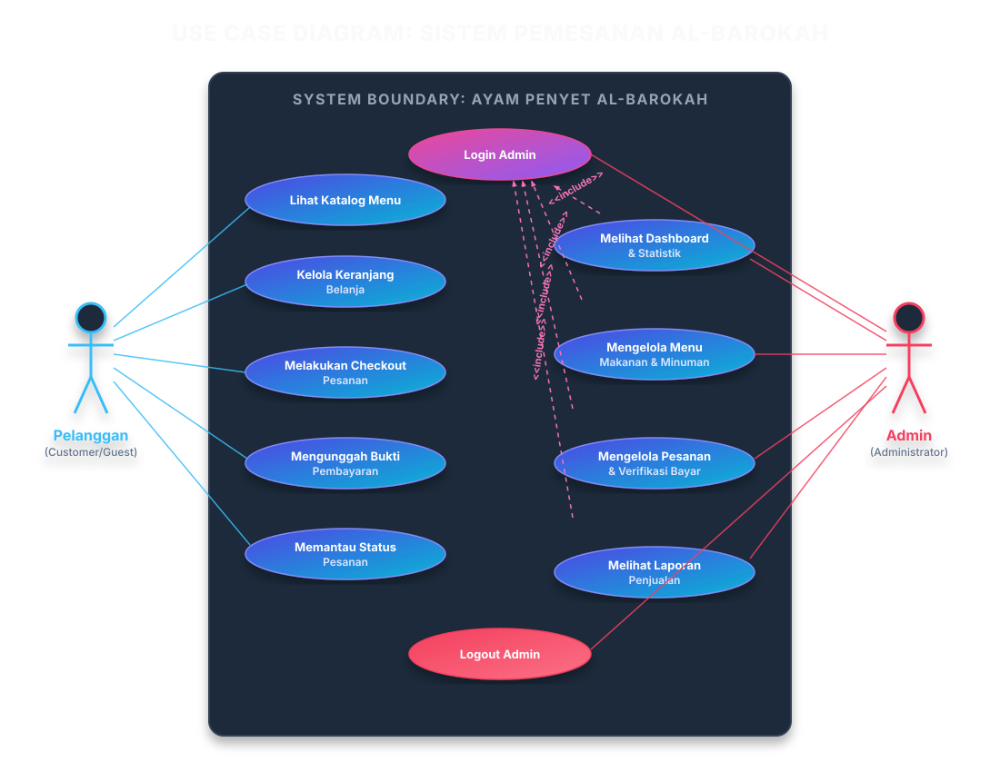

Selain representasi berkas gambar SVG di atas, berikut adalah visualisasi hubungan fungsional aktor dan use case yang didefinisikan secara interaktif dalam sistem:

```mermaid
usecaseDiagram
    actor Pelanggan as "Pelanggan (Guest/Member)"
    actor Admin as "Admin (Kasir/Pemilik)"

    %% Use Cases Pelanggan
    usecase UC1 as "Lihat Katalog Menu"
    usecase UC2 as "Kelola Keranjang Belanja"
    usecase UC3 as "Melakukan Checkout"
    usecase UC4 as "Mengunggah Bukti Bayar"
    usecase UC5 as "Memantau Status Pesanan"

    %% Use Cases Admin
    usecase UC6 as "Login Admin"
    usecase UC7 as "Melihat Dashboard"
    usecase UC8 as "Mengelola Menu (CRUD)"
    usecase UC9 as "Mengelola Pesanan"
    usecase UC10 as "Melihat Laporan Penjualan"
    usecase UC11 as "Logout Admin"

    %% Relationships Pelanggan
    Pelanggan --> UC1
    Pelanggan --> UC2
    Pelanggan --> UC3
    Pelanggan --> UC4
    Pelanggan --> UC5

    %% Relationships Admin
    Admin --> UC6
    Admin --> UC7
    Admin --> UC8
    Admin --> UC9
    Admin --> UC10
    Admin --> UC11

    %% Includes relationships
    UC7 ..> UC6 : <<include>>
    UC8 ..> UC6 : <<include>>
    UC9 ..> UC6 : <<include>>
    UC10 ..> UC6 : <<include>>
```

### 4.4.2 Tabel Deskripsi Use Case
Rangkuman uraian fungsionalitas singkat dari masing-masing Use Case sistem Ayam Penyet Al-Barokah adalah sebagai berikut:

<table border="1" cellpadding="8" cellspacing="0" style="border-collapse: collapse; width: 100%; font-family: Arial, sans-serif; font-size: 11pt; margin-bottom: 20px;">
  <thead>
    <tr style="background-color: #f2f2f2;">
      <th style="width: 8%; font-weight: bold; text-align: center; border: 1px solid #a0a0a0;">No</th>
      <th style="width: 22%; font-weight: bold; text-align: left; border: 1px solid #a0a0a0;">Aktor Utama</th>
      <th style="width: 30%; font-weight: bold; text-align: left; border: 1px solid #a0a0a0;">Nama Use Case</th>
      <th style="width: 40%; font-weight: bold; text-align: left; border: 1px solid #a0a0a0;">Deskripsi Singkat</th>
    </tr>
  </thead>
  <tbody>
    <tr>
      <td style="border: 1px solid #a0a0a0; text-align: center;">1</td>
      <td style="border: 1px solid #a0a0a0; font-weight: bold;" rowspan="5">Pelanggan</td>
      <td style="border: 1px solid #a0a0a0; font-weight: bold;">Lihat Katalog Menu</td>
      <td style="border: 1px solid #a0a0a0;">Pelanggan menjelajahi daftar menu makanan/minuman yang aktif beserta harga, deskripsi, dan ketersediaannya di halaman beranda.</td>
    </tr>
    <tr>
      <td style="border: 1px solid #a0a0a0; text-align: center;">2</td>
      <td style="border: 1px solid #a0a0a0; font-weight: bold;">Kelola Keranjang Belanja</td>
      <td style="border: 1px solid #a0a0a0;">Pelanggan menambah menu ke keranjang, merubah kuantitas item, dan menghapus item belanja.</td>
    </tr>
    <tr>
      <td style="border: 1px solid #a0a0a0; text-align: center;">3</td>
      <td style="border: 1px solid #a0a0a0; font-weight: bold;">Melakukan Checkout</td>
      <td style="border: 1px solid #a0a0a0;">Pelanggan mengisi identitas diri dan memilih tipe pengiriman untuk mengirimkan data order.</td>
    </tr>
    <tr>
      <td style="border: 1px solid #a0a0a0; text-align: center;">4</td>
      <td style="border: 1px solid #a0a0a0; font-weight: bold;">Mengunggah Bukti Bayar</td>
      <td style="border: 1px solid #a0a0a0;">Pelanggan mengunggah foto bukti transfer (Platform DANA/SeaBank) untuk konfirmasi pembayaran.</td>
    </tr>
    <tr>
      <td style="border: 1px solid #a0a0a0; text-align: center;">5</td>
      <td style="border: 1px solid #a0a0a0; font-weight: bold;">Memantau Status</td>
      <td style="border: 1px solid #a0a0a0;">Pelanggan memantau status pesanan dan rincian transaksi secara real-time.</td>
    </tr>
    <tr>
      <td style="border: 1px solid #a0a0a0; text-align: center;">6</td>
      <td style="border: 1px solid #a0a0a0; font-weight: bold;" rowspan="6">Admin</td>
      <td style="border: 1px solid #a0a0a0; font-weight: bold;">Login Admin</td>
      <td style="border: 1px solid #a0a0a0;">Admin memverifikasi hak akses masuk ke panel administrator.</td>
    </tr>
    <tr>
      <td style="border: 1px solid #a0a0a0; text-align: center;">7</td>
      <td style="border: 1px solid #a0a0a0; font-weight: bold;">Melihat Dashboard</td>
      <td style="border: 1px solid #a0a0a0;">Admin melihat rangkuman performa omzet keuangan, jumlah pesanan, dan daftar pesanan terbaru.</td>
    </tr>
    <tr>
      <td style="border: 1px solid #a0a0a0; text-align: center;">8</td>
      <td style="border: 1px solid #a0a0a0; font-weight: bold;">Mengelola Menu</td>
      <td style="border: 1px solid #a0a0a0;">Admin melakukan CRUD data menu makanan dan minuman (tambah, edit, hapus foto/menu).</td>
    </tr>
    <tr>
      <td style="border: 1px solid #a0a0a0; text-align: center;">9</td>
      <td style="border: 1px solid #a0a0a0; font-weight: bold;">Mengelola Pesanan</td>
      <td style="border: 1px solid #a0a0a0;">Admin memantau pesanan masuk, memverifikasi file bukti transfer bank, dan mengupdate status pesanan.</td>
    </tr>
    <tr>
      <td style="border: 1px solid #a0a0a0; text-align: center;">10</td>
      <td style="border: 1px solid #a0a0a0; font-weight: bold;">Melihat Laporan</td>
      <td style="border: 1px solid #a0a0a0;">Admin menyaring omzet penjualan bulanan/harian berdasarkan tanggal serta mencetaknya secara fisik.</td>
    </tr>
    <tr>
      <td style="border: 1px solid #a0a0a0; text-align: center;">11</td>
      <td style="border: 1px solid #a0a0a0; font-weight: bold;">Logout Admin</td>
      <td style="border: 1px solid #a0a0a0;">Admin keluar dari sistem panel administrator dan menghancurkan sesi aktif.</td>
    </tr>
  </tbody>
</table>

### 4.4.3 Activity Diagram
Activity diagram digunakan untuk menggambarkan alur kerja utama pada sistem informasi pemesanan online berbasis web di Ayam Penyet Al-Barokah, mulai dari proses menjelajahi katalog menu, melakukan checkout pesanan, mengunggah bukti pembayaran, memantau status pesanan, hingga verifikasi pesanan dan peninjauan laporan penjualan oleh admin. Diagram aktivitas ini membantu memvisualisasikan urutan langkah yang dilakukan aktor (admin dan pelanggan) sehingga aliran proses menjadi lebih mudah dipahami dan dianalisis. Pemodelan ini dipetakan ke dalam 11 activity diagram yang merepresentasikan masing-masing use case fungsional di dalam sistem:

#### 1. Activity Diagram: Login Admin
Proses login merupakan langkah awal bagi Admin untuk mengakses fitur-fitur di dalam panel administrator Sistem Pemesanan Online Ayam Penyet Al-Barokah. Diagram aktivitas ini menggambarkan bagaimana sistem memverifikasi identitas Admin berdasarkan username dan password yang dimasukkan melalui halaman `login.php`.

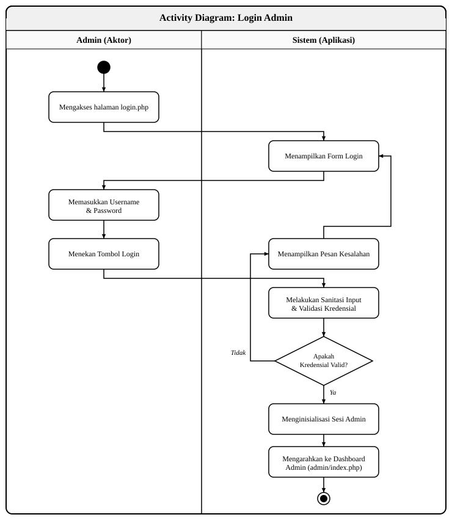
* Berkas editable Draw.io: [activity_login_admin.drawio](assets/images/activity_login_admin.drawio)

Narasi alur aktivitas diagram di atas dapat diuraikan sebagai berikut:
* Admin mengakses halaman login admin panel di berkas `login.php`.
* Sistem memuat antarmuka dan menampilkan formulir login berisi input Username dan Password.
* Admin memasukkan kredensial Username dan Password yang valid lalu mengeklik tombol 'Login'.
* Sistem menerima data input dan mencocokkannya dengan record di database.
* Terjadi percabangan (Apakah data cocok?):
  * Jika **TIDAK cocok**, sistem menampilkan pesan kesalahan login dan mengembalikan Admin ke halaman login.
  * Jika **COCOK**, sistem menginisiasi sesi login aktif (`$_SESSION['admin'] = true`) dan mengalihkan halaman.
* Sistem menampilkan panel dashboard utama admin (`admin/index.php`).

#### 2. Activity Diagram: Dashboard & Statistik Admin
Proses melihat dashboard & statistik merupakan aktivitas bagi Admin untuk memantau ringkasan hasil penjualan dan visualisasi grafik bisnis secara real-time. Diagram ini menjelaskan bagaimana sistem menyajikan data statistik penjualan.

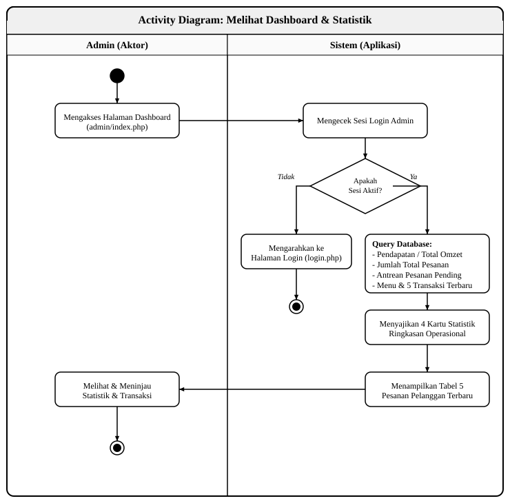
* Berkas editable Draw.io: [activity_dashboard_admin.drawio](assets/images/activity_dashboard_admin.drawio)

Narasi alur aktivitas diagram di atas dapat diuraikan sebagai berikut:
* Admin mengakses dashboard utama panel admin.
* Sistem memproses data transaksi dari database, menghitung total omzet lunas, jumlah pesanan, dan menu terlaris.
* Sistem menampilkan widget statistik angka ringkasan performa penjualan dan merender grafik visual harian/mingguan.
* Admin membaca dan menganalisis informasi statistik penjualan tersebut untuk keperluan bisnis.

#### 3. Activity Diagram: Mengelola Menu Makanan & Minuman
Proses mengelola menu merupakan aktivitas CRUD (Create, Read, Update, Delete) yang dilakukan oleh Admin untuk memelihara ketersediaan data menu hidangan di sistem. Diagram ini menjelaskan bagaimana sistem memproses penambahan, pengubahan, dan penghapusan menu.

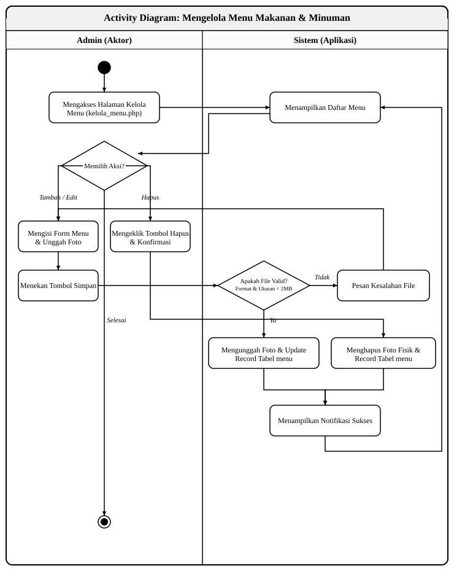
* Berkas editable Draw.io: [activity_menu_admin.drawio](assets/images/activity_menu_admin.drawio)

Narasi alur aktivitas diagram di atas dapat diuraikan sebagai berikut:
* Admin membuka halaman kelola menu (`admin/kelola_menu.php`).
* Sistem mengambil data menu dari database dan memaparkan daftarnya di layar.
* Admin memilih aksi kelola menu yang diinginkan (Tambah, Edit, atau Hapus):
  * **Tambah Menu**: Admin mengeklik 'Tambah', mengisi formulir menu, mengunggah berkas foto, dan klik Simpan. Sistem menyimpan record baru di DB.
  * **Edit Menu**: Admin memilih menu, mengeklik 'Edit', mengubah data menu, dan klik Simpan. Sistem memperbarui record menu di database.
  * **Hapus Menu**: Admin mengeklik 'Hapus' pada baris data menu dan menyetujui konfirmasi. Sistem menghapus data dari database.
* Sistem memuat ulang halaman kelola menu dan memperbarui daftar data menu terbaru di layar.

#### 4. Activity Diagram: Mengelola Pesanan & Verifikasi Pembayaran
Proses mengelola pesanan merupakan langkah bagi Admin untuk memeriksa dan memverifikasi bukti transfer pembayaran dari pelanggan. Diagram ini menjelaskan bagaimana sistem memproses validasi pembayaran dan memperbarui status pesanan.

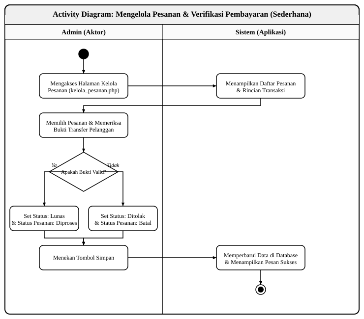
* Berkas editable Draw.io: [activity_pesanan_admin.drawio](assets/images/activity_pesanan_admin.drawio)

Narasi alur aktivitas diagram di atas dapat diuraikan sebagai berikut:
* Admin mengakses halaman kelola pesanan (`kelola_pesanan.php`).
* Sistem menampilkan tabel daftar pesanan masuk dari database.
* Admin memilih salah satu pesanan baru dan memeriksa foto bukti transfer pembayaran yang diunggah pelanggan.
* Terjadi percabangan verifikasi (Apakah bukti transfer valid dan dana masuk?):
  * Jika **YA (Valid)**, Admin mengubah status pembayaran menjadi 'Lunas' dan status pesanan menjadi 'Diproses'.
  * Jika **TIDAK (Palsu/Salah)**, Admin mengubah status pembayaran menjadi 'Ditolak' dan status pesanan menjadi 'Dibatalkan'.
* Admin mengeklik tombol 'Simpan'.
* Sistem memperbarui status data pesanan di database dan menampilkan pesan sukses di layar.

#### 5. Activity Diagram: Melihat Laporan Penjualan
Proses melihat laporan merupakan aktivitas bagi Admin untuk meninjau akumulasi pendapatan kotor pada periode tertentu dan mencetaknya. Diagram ini menjelaskan bagaimana sistem memproses penyaringan data berdasarkan rentang tanggal dan pencetakan dokumen.

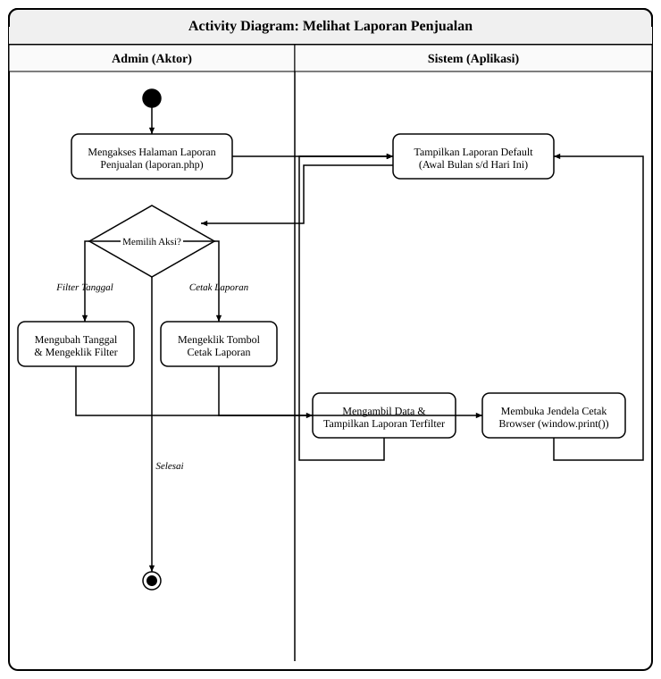
* Berkas editable Draw.io: [activity_laporan_admin.drawio](assets/images/activity_laporan_admin.drawio)

Narasi alur aktivitas diagram di atas dapat diuraikan sebagai berikut:
* Admin mengakses halaman laporan penjualan (`laporan.php`).
* Sistem memuat data penjualan default (tanggal 1 awal bulan s/d hari ini) dan menampilkan tabel rekapitulasi penjualan di layar.
* Terjadi percabangan aksi oleh Admin:
  * **Filter Laporan**: Admin memasukkan rentang tanggal baru dan klik 'Filter'. Sistem memuat ulang data terfilter.
  * **Cetak Laporan**: Admin mengeklik 'Cetak'. Sistem memicu dialog cetak browser (`window.print()`) untuk cetak fisik/PDF.
  * **Selesai**: Admin menutup menu laporan penjualan.

#### 6. Activity Diagram: Logout Admin
Proses logout merupakan tindakan bagi Admin untuk keluar dari sesi akun admin saat ini guna mengamankan sistem dari akses tidak sah. Diagram ini menjelaskan bagaimana sistem menghancurkan data sesi aktif.

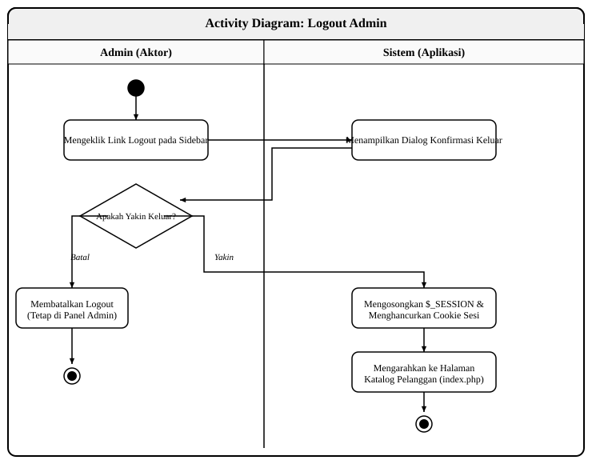
* Berkas editable Draw.io: [activity_logout_admin.drawio](assets/images/activity_logout_admin.drawio)

Narasi alur aktivitas diagram di atas dapat diuraikan sebagai berikut:
* Admin mengeklik tombol 'Logout' di sidebar admin panel.
* Sistem menampilkan pop-up konfirmasi keluar ('Apakah Anda yakin?').
* Terjadi percabangan keputusan Admin:
  * Jika **BATAL**, Admin tetap di panel admin dengan sesi aktif (Alur Selesai).
  * Jika **YAKIN**, sistem memproses logout.
* Sistem menghapus data sesi (`$_SESSION`) dan cookie, lalu mengeksekusi `session_destroy()`.
* Sistem mengalihkan browser kembali ke halaman katalog utama pelanggan (`index.php`).

#### 7. Activity Diagram: Lihat Katalog Menu (Pelanggan)
Proses melihat katalog menu merupakan aktivitas bagi Pelanggan untuk menjelajahi seluruh menu kuliner terdaftar beserta harganya secara interaktif. Diagram ini menjelaskan bagaimana sistem menyajikan menu dan memproses filter kategori.

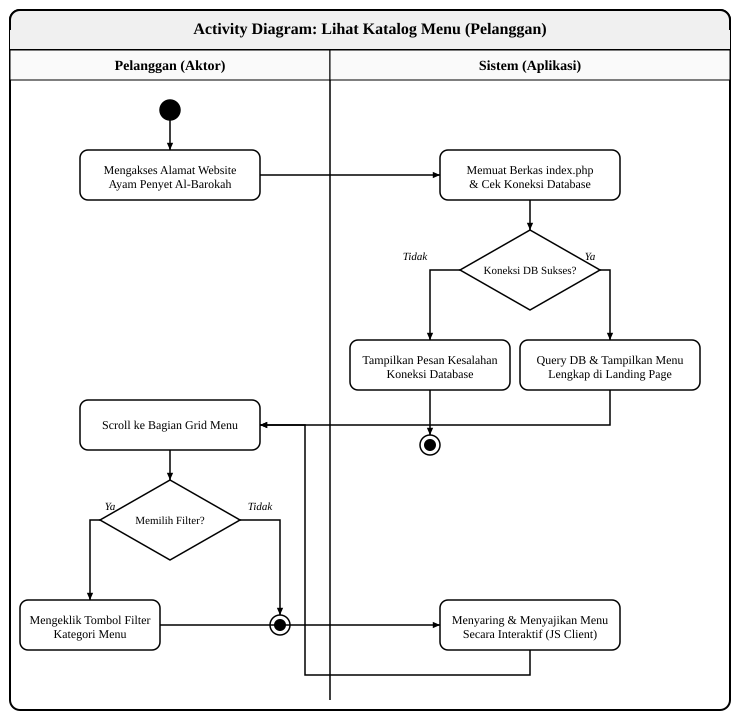
* Berkas editable Draw.io: [activity_lihat_menu_pelanggan.drawio](assets/images/activity_lihat_menu_pelanggan.drawio)

Narasi alur aktivitas diagram di atas dapat diuraikan sebagai berikut:
* Pelanggan mengakses URL website Ayam Penyet Al-Barokah di browser.
* Sistem memuat file `index.php` dan memeriksa koneksi basis data.
* Terjadi percabangan (Apakah koneksi database sukses?):
  * Jika **GAGAL**, sistem menghentikan proses dan menampilkan pesan error koneksi database di layar.
  * Jika **YA (Sukses)**, sistem melakukan query data menu dari database.
* Sistem menyajikan landing page dengan grid kartu-kartu menu kuliner yang aktif.
* Pelanggan melakukan scroll ke bagian menu dan melihat daftar kuliner.
* Terjadi percabangan aksi (Memilih filter kategori menu?):
  * Jika **YA**, Pelanggan mengeklik tombol filter. Sistem (melalui JS client-side) menyaring menu interaktif secara instan.
  * Jika **TIDAK**, pelanggan lanjut menjelajahi menu default.

#### 8. Activity Diagram: Tambah ke Keranjang (Pelanggan)
Proses menambah ke keranjang merupakan langkah bagi Pelanggan untuk memasukkan menu hidangan pilihan ke dalam keranjang belanja digital. Diagram ini menjelaskan bagaimana sistem memproses penambahan item ke dalam sesi keranjang.

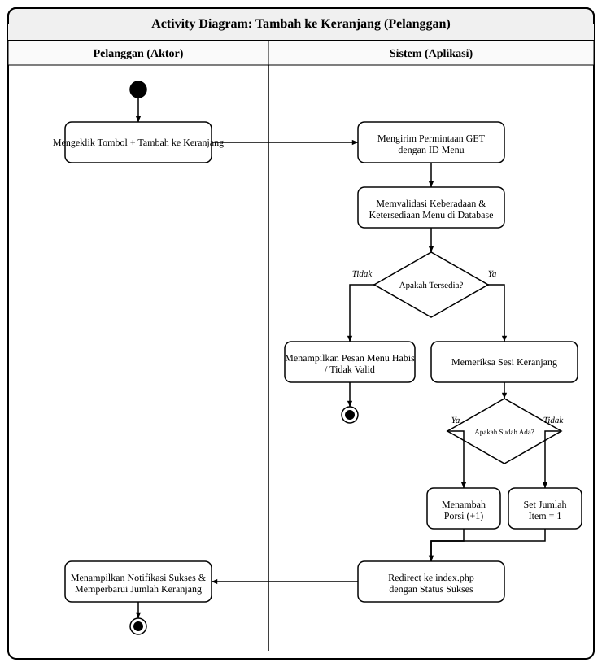
* Berkas editable Draw.io: [activity_keranjang_pelanggan.drawio](assets/images/activity_keranjang_pelanggan.drawio)

Narasi alur aktivitas diagram di atas dapat diuraikan sebagai berikut:
* Pelanggan mengeklik tombol '+ Tambah ke Keranjang' pada kartu menu kuliner pilihan.
* Sistem mengirim permintaan GET dengan parameter ID menu pilihan.
* Sistem memvalidasi ke database bahwa menu terdaftar dan berstatus 'tersedia'.
* Terjadi percabangan status (Apakah menu tersedia?):
  * Jika **TIDAK**, sistem membatalkan proses dan menampilkan notifikasi kesalahan di layar.
  * Jika **YA**, sistem memeriksa keranjang belanja pada session.
* Terjadi percabangan pengecekan item keranjang (Apakah menu sudah ada di keranjang?):
  * Jika **YA**, sistem menambahkan jumlah porsi menu tersebut sebanyak 1 (+1).
  * Jika **TIDAK**, sistem menetapkan menu ke keranjang dengan kuantitas 1.
* Sistem mengalihkan browser kembali ke beranda dengan parameter sukses.
* Sistem memuat ulang halaman beranda, menampilkan notifikasi toast sukses hijau, dan memperbarui jumlah navigasi ikon keranjang.

#### 9. Activity Diagram: Melakukan Checkout Pesanan (Pelanggan)
Proses checkout merupakan langkah bagi Pelanggan untuk menyelesaikan transaksi belanja dengan melengkapi informasi identitas pengiriman. Diagram ini menjelaskan bagaimana sistem mencatat pesanan induk dan rincian item ke database.

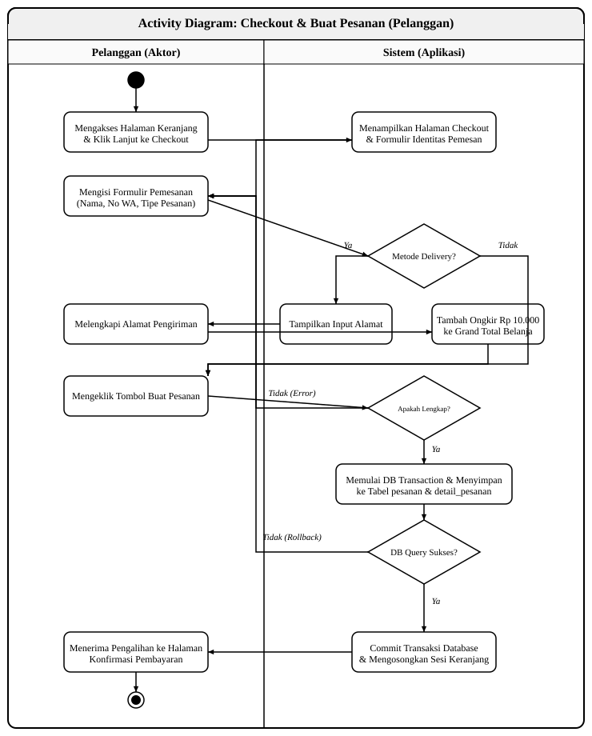
* Berkas editable Draw.io: [activity_checkout_pelanggan.drawio](assets/images/activity_checkout_pelanggan.drawio)

Narasi alur aktivitas diagram di atas dapat diuraikan sebagai berikut:
* Pelanggan mengakses halaman keranjang belanja dan mengeklik tombol 'Lanjut ke Checkout'.
* Sistem menampilkan halaman Checkout beserta formulir data pemesanan.
* Pelanggan mengisi data formulir (Nama, No Telepon, dan Tipe Pesanan).
* Terjadi percabangan tipe pesanan (Apakah tipe pesanan adalah Delivery?):
  * Jika **YA**, sistem menampilkan kolom input alamat. Pelanggan mengisi alamat tujuan, dan sistem menambahkan biaya kirim Rp 10.000 ke total tagihan.
  * Jika **TIDAK (Dine In / Take Away)**, alur langsung berlanjut.
* Pelanggan mengeklik tombol 'Buat Pesanan Sekarang'.
* Terjadi percabangan input (Apakah formulir data lengkap?):
  * Jika **TIDAK LENGKAP**, sistem membatalkan dan memaparkan pesan error di formulir.
  * Jika **LENGKAP**, sistem memulai database transaction.
* Sistem melakukan query SQL menyimpan data pesanan induk ke tabel 'pesanan' dan data item rincian ke tabel 'detail_pesanan'.
* Terjadi percabangan database (Apakah query database sukses?):
  * Jika **GAGAL**, sistem menjalankan rollback transaksi agar data konsisten, menampilkan pesan error, dan kembali ke formulir.
  * Jika **YA (Sukses)**, sistem melakukan commit transaksi database secara permanen dan mengosongkan sesi keranjang belanja.
* Sistem mengalihkan browser pelanggan ke halaman konfirmasi pembayaran (`fitur_pemesanan/konfirmasi-bayar.php?kode=ALB-YYMMDD-HHMMSS`).

#### 10. Activity Diagram: Mengunggah Bukti Pembayaran (Pelanggan)
Proses mengunggah bukti pembayaran merupakan aktivitas bagi Pelanggan untuk mengkonfirmasi transfer dana belanja yang telah dilakukan. Diagram ini menjelaskan bagaimana sistem menerima file foto bukti bayar dan memperbarui status pembayaran.

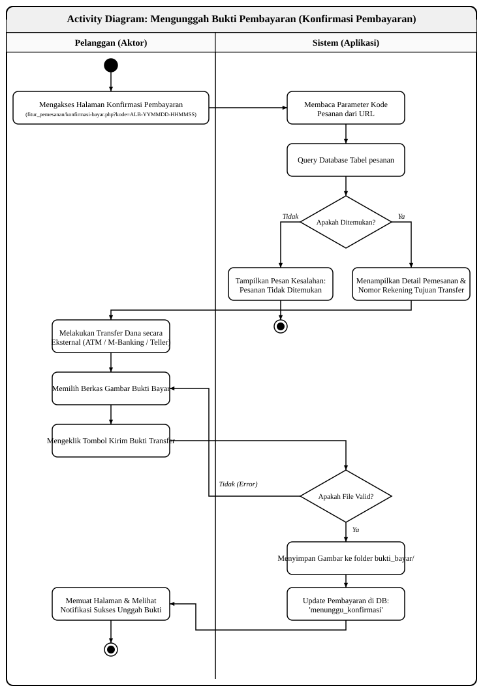
* Berkas editable Draw.io: [activity_konfirmasi_pelanggan.drawio](assets/images/activity_konfirmasi_pelanggan.drawio)

Narasi alur aktivitas diagram di atas dapat diuraikan sebagai berikut:
* Pelanggan mengakses URL halaman Konfirmasi Pembayaran (`fitur_pemesanan/konfirmasi-bayar.php?kode=ALB-YYMMDD-HHMMSS`).
* Sistem membaca parameter kode pesanan dari URL.
* Sistem melakukan query database ke tabel `pesanan` berdasarkan kode pesanan tersebut.
* Terjadi percabangan data (Apakah pesanan ditemukan?):
  * Jika **TIDAK**, sistem membatalkan penampilan status dan menampilkan pesan kesalahan bahwa pesanan tidak ditemukan.
  * Jika **YA**, sistem menyajikan detail data transaksi lengkap dengan nomor rekening bank resmi untuk tujuan transfer.
* Pelanggan mentransfer dana sesuai tagihan secara eksternal (ATM/M-banking/Teller).
* Pelanggan memilih berkas foto bukti transaksi pembayaran (JPG/JPEG/PNG) dan mengeklik tombol 'Kirim Bukti Transfer'.
* Sistem menerima berkas unggahan dan memeriksa kesesuaian tipe format serta batas ukuran berkas (maks 2MB).
* Terjadi percabangan validasi file (Apakah file valid?):
  * Jika **TIDAK VALID**, sistem membatalkan proses unggah, menyajikan pesan error, dan kembali ke langkah pemilihan file.
  * Jika **YA**, sistem menyimpan berkas fisik gambar ke folder server `bukti_bayar/`.
* Sistem melakukan UPDATE data pesanan di database (mengisi nama file pada kolom `bukti_pembayaran` dan mengubah `status_pembayaran` menjadi 'menunggu_konfirmasi').
* Sistem melakukan memuat ulang halaman secara otomatis dan menampilkan notifikasi sukses unggah bukti bayar.

#### 11. Activity Diagram: Memantau Status Pesanan (Pelanggan)
Proses memantau status pesanan merupakan aktivitas bagi Pelanggan untuk memeriksa kemajuan pembuatan dan pengantaran hidangan secara real-time. Diagram ini menjelaskan bagaimana sistem menyajikan status pesanan terbaru dari database.

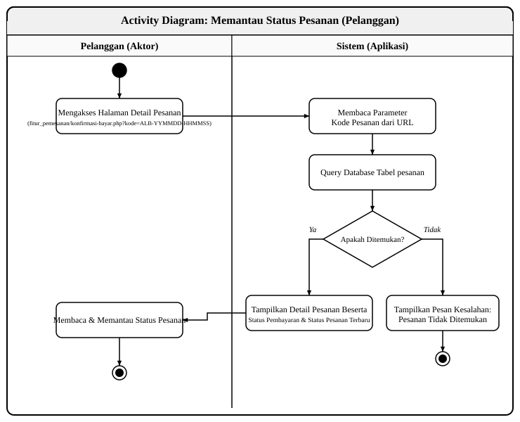
* Berkas editable Draw.io: [activity_pantau_status_pelanggan.drawio](assets/images/activity_pantau_status_pelanggan.drawio)

Narasi alur aktivitas diagram di atas dapat diuraikan sebagai berikut:
* Pelanggan mengakses URL halaman detail pesanan (`fitur_pemesanan/konfirmasi-bayar.php?kode=ALB-YYMMDD-HHMMSS`).
* Sistem membaca parameter kode pesanan dari URL.
* Sistem menjalankan query ke database tabel 'pesanan' untuk menarik status terbaru.
* Terjadi percabangan data (Apakah pesanan ditemukan?):
  * Jika **TIDAK**, sistem membatalkan pemuatan status dan menampilkan pesan kesalahan.
  * Jika **YA**, sistem menyajikan detail data transaksi lengkap dengan badge penanda status pembayaran dan status pemrosesan pesanan terupdate secara real-time.
* Pelanggan membaca dan memantau status perkembangan pesanan.

### 4.4.4 Class Diagram
Class Diagram digunakan untuk menampilkan struktur statis dari sistem dengan menggambarkan kelas-kelas, atribut-atribut, operasi-operasi, dan hubungan antar kelas. Class Diagram merupakan diagram yang paling umum digunakan dalam perancangan sistem berorientasi objek karena mampu menunjukkan blueprint struktur database dan logika aplikasi secara visual. Dalam konteks Sistem Pemesanan Online Ayam Penyet Al-Barokah, Class Diagram menggambarkan entitas-entitas utama seperti User, Menu, Pesanan, dan DetailPesanan beserta relasi antar entitas tersebut.

Class Diagram terdiri dari tiga komponen utama:
1. Class Name (Nama Kelas): Nama dari entitas yang direpresentasikan.
2. Attributes (Atribut): Properti atau data yang dimiliki oleh kelas.
3. Methods (Metode): Operasi atau fungsi yang dapat dilakukan oleh kelas.

Berikut adalah Class Diagram untuk Sistem Pemesanan Online Ayam Penyet Al-Barokah:

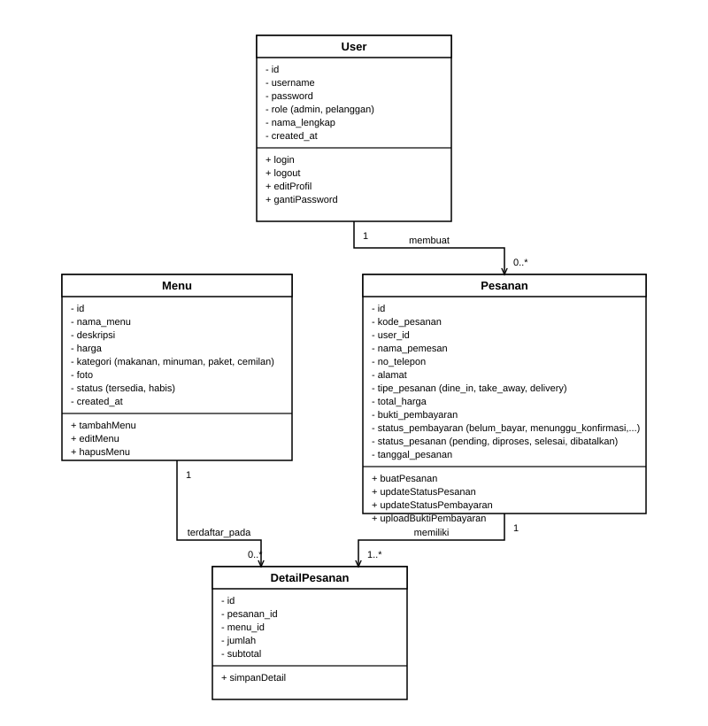
Gambar 4. 12 Class Diagram - Sistem Pemesanan Online Ayam Penyet Al-Barokah
* Berkas editable Draw.io: [class_diagram.drawio](assets/images/class_diagram.drawio)

Selain representasi berkas gambar SVG di atas, berikut adalah visualisasi hubungan relasional antarentitas yang didefinisikan secara interaktif dalam sistem:

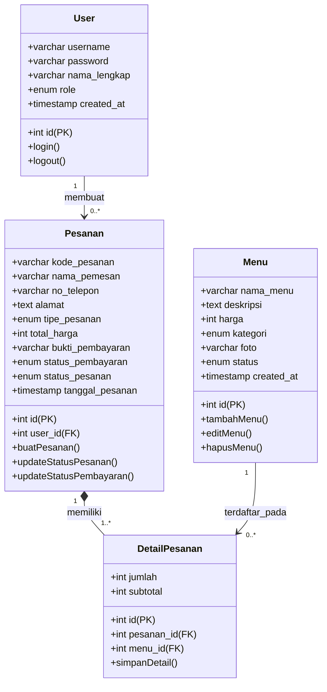
```mermaid
classDiagram
    direction TB
    class User {
        +int id (PK)
        +varchar username
        +varchar password
        +varchar nama_lengkap
        +enum role
        +timestamp created_at
        +login()
        +logout()
    }

    class Menu {
        +int id (PK)
        +varchar nama_menu
        +text deskripsi
        +int harga
        +enum kategori
        +varchar foto
        +enum status
        +timestamp created_at
        +tambahMenu()
        +editMenu()
        +hapusMenu()
    }

    class Pesanan {
        +int id (PK)
        +varchar kode_pesanan
        +int user_id (FK)
        +varchar nama_pemesan
        +varchar no_telepon
        +text alamat
        +enum tipe_pesanan
        +int total_harga
        +varchar bukti_pembayaran
        +enum status_pembayaran
        +enum status_pesanan
        +timestamp tanggal_pesanan
        +buatPesanan()
        +updateStatusPesanan()
        +updateStatusPembayaran()
    }

    class DetailPesanan {
        +int id (PK)
        +int pesanan_id (FK)
        +int menu_id (FK)
        +int jumlah
        +int subtotal
        +simpanDetail()
    }

    User "1" --> "0..*" Pesanan : membuat
    Pesanan "1" *-- "1..*" DetailPesanan : memiliki
    Menu "1" --> "0..*" DetailPesanan : terdaftar_pada
```

#### 4.4.4.1 Narasi Hubungan Antarkelas dan Komponen Class Diagram
Berdasarkan visualisasi *Class Diagram* di atas, berikut adalah penjelasan detail mengenai masing-masing kelas (entitas), atribut, metode, serta hubungan relasional antarentitas yang menyusun sistem:

##### A. Deskripsi Kelas (Entities)
1. **User**
   * **Deskripsi:** Kelas yang merepresentasikan pengguna sistem, baik pelanggan terdaftar maupun admin kasir/pemilik warung yang mengoperasikan panel kontrol.
   * **Atribut:**
     * `id` (INT - Primary Key): Kode pengenal unik otomatis untuk setiap akun pengguna.
     * `username` (VARCHAR): Nama pengguna unik untuk melakukan autentikasi masuk ke dalam sistem.
     * `password` (VARCHAR): Kata sandi terenkripsi untuk mengamankan hak akses akun.
     * `nama_lengkap` (VARCHAR): Nama lengkap dari pemilik akun.
     * `role` (ENUM): Peran otoritas pengguna di dalam aplikasi (misalnya `'admin'` atau `'pelanggan'`).
     * `created_at` (TIMESTAMP): Waktu saat akun pertama kali didaftarkan.
   * **Metode (Methods):**
     * `login()`: Fungsi untuk memverifikasi kecocokan kredensial login dan memulai sesi aktif.
     * `logout()`: Fungsi untuk mengakhiri sesi aktif pengguna dan menghapus data sesi.

2. **Menu**
   * **Deskripsi:** Kelas yang merepresentasikan data katalog hidangan (makanan dan minuman) yang dijual di Warung Ayam Penyet Al-Barokah.
   * **Atribut:**
     * `id` (INT - Primary Key): Identitas unik dari menu makanan atau minuman.
     * `nama_menu` (VARCHAR): Nama hidangan menu.
     * `deskripsi` (TEXT): Informasi deskriptif mengenai bahan atau keistimewaan menu.
     * `harga` (INT): Nilai nominal harga jual per porsi menu.
     * `kategori` (ENUM): Klasifikasi jenis menu (makanan, minuman, cemilan, paket).
     * `foto` (VARCHAR): Path atau nama file foto menu yang diunggah ke server.
     * `status` (ENUM): Status ketersediaan menu di dapur (`'tersedia'`, `'habis'`).
     * `created_at` (TIMESTAMP): Tanggal data menu ditambahkan ke basis data.
   * **Metode (Methods):**
     * `tambahMenu()`: Fungsi untuk mendaftarkan menu hidangan baru ke katalog.
     * `editMenu()`: Fungsi untuk memperbarui informasi data menu yang ada.
     * `hapusMenu()`: Fungsi untuk menghapus menu dari katalog penjualan.

3. **Pesanan**
   * **Deskripsi:** Kelas utama transaksi pemesanan yang mencatat data pemesanan yang diajukan oleh pelanggan (baik terdaftar maupun guest).
   * **Atribut:**
     * `id` (INT - Primary Key): Nomor unik identitas transaksi pemesanan.
     * `kode_pesanan` (VARCHAR): Kode pelacakan pesanan terformat unik (ALB-YYMMDD-HHMMSS).
     * `user_id` (INT - Foreign Key): Relasi ke kelas `User` (bernilai NULL jika pemesanan bertipe Checkout Guest).
     * `nama_pemesan` (VARCHAR): Nama lengkap pelanggan pembuat pesanan.
     * `no_telepon` (VARCHAR): Nomor telepon aktif untuk keperluan kontak dan pengantaran.
     * `alamat` (TEXT): Alamat pengantaran terperinci (hanya diisi jika memilih tipe pengiriman delivery).
     * `tipe_pesanan` (ENUM): Jenis pengambilan hidangan (`'dine_in'`, `'take_away'`, atau `'delivery'`).
     * `total_harga` (INT): Total nominal tagihan transaksi (ditambah ongkos kirim jika delivery).
     * `bukti_pembayaran` (VARCHAR): Nama file gambar bukti transfer yang diunggah pelanggan.
     * `status_pembayaran` (ENUM): Status verifikasi pembayaran (`'belum_bayar'`, `'menunggu_konfirmasi'`, `'lunas'`, `'ditolak'`).
     * `status_pesanan` (ENUM): Status progres hidangan dapur (`'pending'`, `'diproses'`, `'selesai'`, `'dibatalkan'`).
     * `tanggal_pesanan` (TIMESTAMP): Tanggal dan waktu pesanan dibuat.
   * **Metode (Methods):**
     * `buatPesanan()`: Fungsi untuk memproses pembuatan data transaksi pesanan baru.
     * `updateStatusPesanan()`: Fungsi untuk memperbarui status pemrosesan hidangan.
     * `updateStatusPembayaran()`: Fungsi untuk memperbarui status keabsahan pembayaran.

4. **DetailPesanan**
   * **Deskripsi:** Kelas detail penghubung (*junction class*) yang mencatat item makanan/minuman spesifik apa saja yang dibeli pada satu transaksi pesanan beserta jumlah dan subtotal harganya.
   * **Atribut:**
     * `id` (INT - Primary Key): Identitas unik baris detail pesanan.
     * `pesanan_id` (INT - Foreign Key): Relasi pengait ke kelas `Pesanan`.
     * `menu_id` (INT - Foreign Key): Relasi pengait ke kelas `Menu`.
     * `jumlah` (INT): Kuantitas porsi hidangan menu yang dibeli.
     * `subtotal` (INT): Total harga per item menu (perkalian jumlah porsi dengan harga menu).
   * **Metode (Methods):**
     * `simpanDetail()`: Fungsi untuk menyimpan rincian barang belanjaan ke basis data.

##### B. Narasi Hubungan (Relationship) Antarkelas
1. **User dengan Pesanan (Asosiasi - `1` ke `0..*`)**
   * **Narasi:** Hubungan ini menunjukkan bahwa satu (`1`) `User` dapat memiliki atau membuat nol hingga banyak (`0..*`) data `Pesanan`. Relasi ini menggunakan asosiasi biasa, di mana kolom `user_id` pada kelas `Pesanan` bertindak sebagai penampung relasi (*Foreign Key*). Keterhubungan opsional ini memungkinkan pelanggan untuk bertransaksi langsung tanpa registrasi akun terlebih dahulu (sebagai *guest*), sehingga nilai `user_id` diizinkan bernilai `NULL` (kosong).
   
2. **Pesanan dengan DetailPesanan (Komposisi - `1` ke `1..*`)**
   * **Narasi:** Hubungan ini bertipe *Composition* (komposisi), di mana satu (`1`) data `Pesanan` memiliki minimal satu atau banyak (`1..*`) data `DetailPesanan` yang mencatat detail hidangan belanjaan. Hubungan komposisi menunjukkan kepemilikan yang bersifat mutlak, yang berarti keberadaan `DetailPesanan` sangat bergantung pada kelas induknya (`Pesanan`). Jika instansiasi objek `Pesanan` dihapus dari database, secara otomatis data `DetailPesanan` yang terkait dengannya ikut terhapus secara permanen (*cascade delete*).

3. **Menu dengan DetailPesanan (Asosiasi - `1` ke `0..*`)**
   * **Narasi:** Hubungan ini bertipe asosiasi satu ke banyak, di mana satu (`1`) `Menu` dapat terdaftar atau dibeli pada nol hingga banyak (`0..*`) `DetailPesanan` dari transaksi yang berbeda-beda. Hal ini merepresentasikan kondisi riil di mana sebuah produk hidangan (misal: "Ayam Penyet Al-Barokah") dapat dipesan berulang kali oleh berbagai pelanggan berbeda di dalam bermacam-macam nomor nota transaksi belanja yang berbeda pula.

### 4.4.5 Rancangan Struktur Data
Rancangan struktur data menjabarkan susunan tabel-tabel yang menjadi fondasi penyimpanan informasi dalam sistem pemesanan online Ayam Penyet Al-Barokah. Setiap tabel dirancang berdasarkan kebutuhan fungsional yang telah ditetapkan sebelumnya, dengan memperhatikan keterhubungan antar tabel melalui mekanisme foreign key untuk menjamin konsistensi dan integritas data.

1. Tabel users
Tabel users berfungsi sebagai pusat pengelolaan data akun seluruh pengguna sistem, baik admin maupun pelanggan. Tabel ini menyimpan informasi penting yang diperlukan untuk proses login, autentikasi, serta pengaturan hak akses sesuai peran masing-masing pengguna.

Tabel 4. 2 Struktur Tabel users
<table border="1" cellpadding="8" cellspacing="0" style="border-collapse: collapse; width: 100%; font-family: Arial, sans-serif; font-size: 11pt; margin-bottom: 20px;">
  <thead>
    <tr style="background-color: #f2f2f2;">
      <th style="width: 8%; font-weight: bold; text-align: center; border: 1px solid #a0a0a0;">No</th>
      <th style="width: 20%; font-weight: bold; text-align: left; border: 1px solid #a0a0a0;">Field</th>
      <th style="width: 25%; font-weight: bold; text-align: left; border: 1px solid #a0a0a0;">Tipe data</th>
      <th style="width: 12%; font-weight: bold; text-align: center; border: 1px solid #a0a0a0;">Key</th>
      <th style="width: 35%; font-weight: bold; text-align: left; border: 1px solid #a0a0a0;">Keterangan</th>
    </tr>
  </thead>
  <tbody>
    <tr>
      <td style="border: 1px solid #a0a0a0; text-align: center;">1</td>
      <td style="border: 1px solid #a0a0a0;"><code>id</code></td>
      <td style="border: 1px solid #a0a0a0;">INT(11)</td>
      <td style="border: 1px solid #a0a0a0; text-align: center;">PK</td>
      <td style="border: 1px solid #a0a0a0;">Identitas unik pengguna yang dibuat otomatis oleh sistem (Auto Increment).</td>
    </tr>
    <tr>
      <td style="border: 1px solid #a0a0a0; text-align: center;">2</td>
      <td style="border: 1px solid #a0a0a0;"><code>username</code></td>
      <td style="border: 1px solid #a0a0a0;">VARCHAR(50)</td>
      <td style="border: 1px solid #a0a0a0; text-align: center;">UQ</td>
      <td style="border: 1px solid #a0a0a0;">Nama pengguna unik untuk keperluan login ke sistem.</td>
    </tr>
    <tr>
      <td style="border: 1px solid #a0a0a0; text-align: center;">3</td>
      <td style="border: 1px solid #a0a0a0;"><code>password</code></td>
      <td style="border: 1px solid #a0a0a0;">VARCHAR(255)</td>
      <td style="border: 1px solid #a0a0a0; text-align: center;">-</td>
      <td style="border: 1px solid #a0a0a0;">Kata sandi akun pengguna terenkripsi.</td>
    </tr>
    <tr>
      <td style="border: 1px solid #a0a0a0; text-align: center;">4</td>
      <td style="border: 1px solid #a0a0a0;"><code>nama_lengkap</code></td>
      <td style="border: 1px solid #a0a0a0;">VARCHAR(100)</td>
      <td style="border: 1px solid #a0a0a0; text-align: center;">-</td>
      <td style="border: 1px solid #a0a0a0;">Nama lengkap pengguna.</td>
    </tr>
    <tr>
      <td style="border: 1px solid #a0a0a0; text-align: center;">5</td>
      <td style="border: 1px solid #a0a0a0;"><code>role</code></td>
      <td style="border: 1px solid #a0a0a0;">ENUM('admin','pelanggan')</td>
      <td style="border: 1px solid #a0a0a0; text-align: center;">-</td>
      <td style="border: 1px solid #a0a0a0;">Peran pengguna (admin atau pelanggan) untuk membatasi hak akses.</td>
    </tr>
    <tr>
      <td style="border: 1px solid #a0a0a0; text-align: center;">6</td>
      <td style="border: 1px solid #a0a0a0;"><code>created_at</code></td>
      <td style="border: 1px solid #a0a0a0;">TIMESTAMP</td>
      <td style="border: 1px solid #a0a0a0; text-align: center;">-</td>
      <td style="border: 1px solid #a0a0a0;">Waktu pencatatan pendaftaran akun pengguna.</td>
    </tr>
  </tbody>
</table>

2. Tabel menu
Tabel menu digunakan untuk menyimpan data seluruh produk kuliner (makanan, minuman, paket, cemilan) yang dikelola oleh admin di dalam sistem. Setiap produk memiliki nama, deskripsi, harga, kategori, foto, dan status ketersediaan.

Tabel 4. 3 Struktur Tabel menu
<table border="1" cellpadding="8" cellspacing="0" style="border-collapse: collapse; width: 100%; font-family: Arial, sans-serif; font-size: 11pt; margin-bottom: 20px;">
  <thead>
    <tr style="background-color: #f2f2f2;">
      <th style="width: 8%; font-weight: bold; text-align: center; border: 1px solid #a0a0a0;">No</th>
      <th style="width: 20%; font-weight: bold; text-align: left; border: 1px solid #a0a0a0;">Field</th>
      <th style="width: 25%; font-weight: bold; text-align: left; border: 1px solid #a0a0a0;">Tipe data</th>
      <th style="width: 12%; font-weight: bold; text-align: center; border: 1px solid #a0a0a0;">Key</th>
      <th style="width: 35%; font-weight: bold; text-align: left; border: 1px solid #a0a0a0;">Keterangan</th>
    </tr>
  </thead>
  <tbody>
    <tr>
      <td style="border: 1px solid #a0a0a0; text-align: center;">1</td>
      <td style="border: 1px solid #a0a0a0;"><code>id</code></td>
      <td style="border: 1px solid #a0a0a0;">INT(11)</td>
      <td style="border: 1px solid #a0a0a0; text-align: center;">PK</td>
      <td style="border: 1px solid #a0a0a0;">Identitas unik produk menu (Auto Increment).</td>
    </tr>
    <tr>
      <td style="border: 1px solid #a0a0a0; text-align: center;">2</td>
      <td style="border: 1px solid #a0a0a0;"><code>nama_menu</code></td>
      <td style="border: 1px solid #a0a0a0;">VARCHAR(100)</td>
      <td style="border: 1px solid #a0a0a0; text-align: center;">-</td>
      <td style="border: 1px solid #a0a0a0;">Nama produk hidangan makanan atau minuman.</td>
    </tr>
    <tr>
      <td style="border: 1px solid #a0a0a0; text-align: center;">3</td>
      <td style="border: 1px solid #a0a0a0;"><code>deskripsi</code></td>
      <td style="border: 1px solid #a0a0a0;">TEXT</td>
      <td style="border: 1px solid #a0a0a0; text-align: center;">-</td>
      <td style="border: 1px solid #a0a0a0;">Penjelasan detail mengenai hidangan (dapat berupa NULL).</td>
    </tr>
    <tr>
      <td style="border: 1px solid #a0a0a0; text-align: center;">4</td>
      <td style="border: 1px solid #a0a0a0;"><code>harga</code></td>
      <td style="border: 1px solid #a0a0a0;">INT(11)</td>
      <td style="border: 1px solid #a0a0a0; text-align: center;">-</td>
      <td style="border: 1px solid #a0a0a0;">Harga jual menu makanan atau minuman per porsi.</td>
    </tr>
    <tr>
      <td style="border: 1px solid #a0a0a0; text-align: center;">5</td>
      <td style="border: 1px solid #a0a0a0;"><code>kategori</code></td>
      <td style="border: 1px solid #a0a0a0;">ENUM('makanan','minuman','paket','cemilan')</td>
      <td style="border: 1px solid #a0a0a0; text-align: center;">-</td>
      <td style="border: 1px solid #a0a0a0;">Kategori klasifikasi produk hidangan kuliner.</td>
    </tr>
    <tr>
      <td style="border: 1px solid #a0a0a0; text-align: center;">6</td>
      <td style="border: 1px solid #a0a0a0;"><code>foto</code></td>
      <td style="border: 1px solid #a0a0a0;">VARCHAR(255)</td>
      <td style="border: 1px solid #a0a0a0; text-align: center;">-</td>
      <td style="border: 1px solid #a0a0a0;">Nama file gambar produk di server direktori assets.</td>
    </tr>
    <tr>
      <td style="border: 1px solid #a0a0a0; text-align: center;">7</td>
      <td style="border: 1px solid #a0a0a0;"><code>status</code></td>
      <td style="border: 1px solid #a0a0a0;">ENUM('tersedia','habis')</td>
      <td style="border: 1px solid #a0a0a0; text-align: center;">-</td>
      <td style="border: 1px solid #a0a0a0;">Status ketersediaan persediaan porsi menu.</td>
    </tr>
    <tr>
      <td style="border: 1px solid #a0a0a0; text-align: center;">8</td>
      <td style="border: 1px solid #a0a0a0;"><code>created_at</code></td>
      <td style="border: 1px solid #a0a0a0;">TIMESTAMP</td>
      <td style="border: 1px solid #a0a0a0; text-align: center;">-</td>
      <td style="border: 1px solid #a0a0a0;">Waktu pembuatan/pengunggahan data menu baru.</td>
    </tr>
  </tbody>
</table>

3. Tabel pesanan
Tabel pesanan menyimpan informasi transaksi utama yang dilakukan pelanggan, lengkap dengan kode transaksi unik, detail pemesan, tipe pesanan (dine in, take away, atau delivery), total harga, status pembayaran, dan status pengerjaan pesanan.

Tabel 4. 4 Struktur Tabel pesanan
<table border="1" cellpadding="8" cellspacing="0" style="border-collapse: collapse; width: 100%; font-family: Arial, sans-serif; font-size: 11pt; margin-bottom: 20px;">
  <thead>
    <tr style="background-color: #f2f2f2;">
      <th style="width: 8%; font-weight: bold; text-align: center; border: 1px solid #a0a0a0;">No</th>
      <th style="width: 20%; font-weight: bold; text-align: left; border: 1px solid #a0a0a0;">Field</th>
      <th style="width: 25%; font-weight: bold; text-align: left; border: 1px solid #a0a0a0;">Tipe data</th>
      <th style="width: 12%; font-weight: bold; text-align: center; border: 1px solid #a0a0a0;">Key</th>
      <th style="width: 35%; font-weight: bold; text-align: left; border: 1px solid #a0a0a0;">Keterangan</th>
    </tr>
  </thead>
  <tbody>
    <tr>
      <td style="border: 1px solid #a0a0a0; text-align: center;">1</td>
      <td style="border: 1px solid #a0a0a0;"><code>id</code></td>
      <td style="border: 1px solid #a0a0a0;">INT(11)</td>
      <td style="border: 1px solid #a0a0a0; text-align: center;">PK</td>
      <td style="border: 1px solid #a0a0a0;">Identitas unik pesanan transaksi (Auto Increment).</td>
    </tr>
    <tr>
      <td style="border: 1px solid #a0a0a0; text-align: center;">2</td>
      <td style="border: 1px solid #a0a0a0;"><code>kode_pesanan</code></td>
      <td style="border: 1px solid #a0a0a0;">VARCHAR(20)</td>
      <td style="border: 1px solid #a0a0a0; text-align: center;">UQ</td>
      <td style="border: 1px solid #a0a0a0;">Kode transaksi unik terformat (ALB-YYMMDD-HHMMSS).</td>
    </tr>
    <tr>
      <td style="border: 1px solid #a0a0a0; text-align: center;">3</td>
      <td style="border: 1px solid #a0a0a0;"><code>user_id</code></td>
      <td style="border: 1px solid #a0a0a0;">INT(11)</td>
      <td style="border: 1px solid #a0a0a0; text-align: center;">FK</td>
      <td style="border: 1px solid #a0a0a0;">Relasi ke <code>users.id</code> (bernilai NULL jika Checkout Guest).</td>
    </tr>
    <tr>
      <td style="border: 1px solid #a0a0a0; text-align: center;">4</td>
      <td style="border: 1px solid #a0a0a0;"><code>nama_pemesan</code></td>
      <td style="border: 1px solid #a0a0a0;">VARCHAR(100)</td>
      <td style="border: 1px solid #a0a0a0; text-align: center;">-</td>
      <td style="border: 1px solid #a0a0a0;">Nama lengkap pelanggan pembeli.</td>
    </tr>
    <tr>
      <td style="border: 1px solid #a0a0a0; text-align: center;">5</td>
      <td style="border: 1px solid #a0a0a0;"><code>no_telepon</code></td>
      <td style="border: 1px solid #a0a0a0;">VARCHAR(20)</td>
      <td style="border: 1px solid #a0a0a0; text-align: center;">-</td>
      <td style="border: 1px solid #a0a0a0;">Nomor kontak telepon atau WhatsApp aktif.</td>
    </tr>
    <tr>
      <td style="border: 1px solid #a0a0a0; text-align: center;">6</td>
      <td style="border: 1px solid #a0a0a0;"><code>alamat</code></td>
      <td style="border: 1px solid #a0a0a0;">TEXT</td>
      <td style="border: 1px solid #a0a0a0; text-align: center;">-</td>
      <td style="border: 1px solid #a0a0a0;">Alamat pengiriman pesanan (khusus delivery).</td>
    </tr>
    <tr>
      <td style="border: 1px solid #a0a0a0; text-align: center;">7</td>
      <td style="border: 1px solid #a0a0a0;"><code>tipe_pesanan</code></td>
      <td style="border: 1px solid #a0a0a0;">ENUM('dine_in','take_away','delivery')</td>
      <td style="border: 1px solid #a0a0a0; text-align: center;">-</td>
      <td style="border: 1px solid #a0a0a0;">Tipe pengambilan pesanan pelanggan.</td>
    </tr>
    <tr>
      <td style="border: 1px solid #a0a0a0; text-align: center;">8</td>
      <td style="border: 1px solid #a0a0a0;"><code>total_harga</code></td>
      <td style="border: 1px solid #a0a0a0;">INT(11)</td>
      <td style="border: 1px solid #a0a0a0; text-align: center;">-</td>
      <td style="border: 1px solid #a0a0a0;">Total tagihan akhir belanja pesanan (ditambah biaya pengiriman Rp10.000 jika Delivery).</td>
    </tr>
    <tr>
      <td style="border: 1px solid #a0a0a0; text-align: center;">9</td>
      <td style="border: 1px solid #a0a0a0;"><code>bukti_pembayaran</code></td>
      <td style="border: 1px solid #a0a0a0;">VARCHAR(255)</td>
      <td style="border: 1px solid #a0a0a0; text-align: center;">-</td>
      <td style="border: 1px solid #a0a0a0;">Nama file gambar bukti transfer yang diunggah oleh pelanggan.</td>
    </tr>
    <tr>
      <td style="border: 1px solid #a0a0a0; text-align: center;">10</td>
      <td style="border: 1px solid #a0a0a0;"><code>status_pembayaran</code></td>
      <td style="border: 1px solid #a0a0a0;">ENUM('belum_bayar','menunggu_konfirmasi','lunas','ditolak')</td>
      <td style="border: 1px solid #a0a0a0; text-align: center;">-</td>
      <td style="border: 1px solid #a0a0a0;">Status konfirmasi transfer dana pelanggan.</td>
    </tr>
    <tr>
      <td style="border: 1px solid #a0a0a0; text-align: center;">11</td>
      <td style="border: 1px solid #a0a0a0;"><code>status_pesanan</code></td>
      <td style="border: 1px solid #a0a0a0;">ENUM('pending','diproses','selesai','dibatalkan')</td>
      <td style="border: 1px solid #a0a0a0; text-align: center;">-</td>
      <td style="border: 1px solid #a0a0a0;">Status operasional pengolahan menu pesanan.</td>
    </tr>
    <tr>
      <td style="border: 1px solid #a0a0a0; text-align: center;">12</td>
      <td style="border: 1px solid #a0a0a0;"><code>tanggal_pesanan</code></td>
      <td style="border: 1px solid #a0a0a0;">TIMESTAMP</td>
      <td style="border: 1px solid #a0a0a0; text-align: center;">-</td>
      <td style="border: 1px solid #a0a0a0;">Waktu pembuatan data order masuk.</td>
    </tr>
  </tbody>
</table>

4. Tabel detail_pesanan
Tabel detail_pesanan berfungsi untuk mencatat rincian menu makanan/minuman yang dibeli dalam setiap transaksi pesanan beserta kuantitas (jumlah porsi) dan subtotal harga untuk masing-masing item.

Tabel 4. 5 Struktur Tabel detail_pesanan
<table border="1" cellpadding="8" cellspacing="0" style="border-collapse: collapse; width: 100%; font-family: Arial, sans-serif; font-size: 11pt; margin-bottom: 20px;">
  <thead>
    <tr style="background-color: #f2f2f2;">
      <th style="width: 8%; font-weight: bold; text-align: center; border: 1px solid #a0a0a0;">No</th>
      <th style="width: 20%; font-weight: bold; text-align: left; border: 1px solid #a0a0a0;">Field</th>
      <th style="width: 25%; font-weight: bold; text-align: left; border: 1px solid #a0a0a0;">Tipe data</th>
      <th style="width: 12%; font-weight: bold; text-align: center; border: 1px solid #a0a0a0;">Key</th>
      <th style="width: 35%; font-weight: bold; text-align: left; border: 1px solid #a0a0a0;">Keterangan</th>
    </tr>
  </thead>
  <tbody>
    <tr>
      <td style="border: 1px solid #a0a0a0; text-align: center;">1</td>
      <td style="border: 1px solid #a0a0a0;"><code>id</code></td>
      <td style="border: 1px solid #a0a0a0;">INT(11)</td>
      <td style="border: 1px solid #a0a0a0; text-align: center;">PK</td>
      <td style="border: 1px solid #a0a0a0;">Identitas unik baris detail (Auto Increment).</td>
    </tr>
    <tr>
      <td style="border: 1px solid #a0a0a0; text-align: center;">2</td>
      <td style="border: 1px solid #a0a0a0;"><code>pesanan_id</code></td>
      <td style="border: 1px solid #a0a0a0;">INT(11)</td>
      <td style="border: 1px solid #a0a0a0; text-align: center;">FK</td>
      <td style="border: 1px solid #a0a0a0;">Relasi ke <code>pesanan.id</code> (Cascaded delete).</td>
    </tr>
    <tr>
      <td style="border: 1px solid #a0a0a0; text-align: center;">3</td>
      <td style="border: 1px solid #a0a0a0;"><code>menu_id</code></td>
      <td style="border: 1px solid #a0a0a0;">INT(11)</td>
      <td style="border: 1px solid #a0a0a0; text-align: center;">FK</td>
      <td style="border: 1px solid #a0a0a0;">Relasi ke <code>menu.id</code> (Cascaded delete).</td>
    </tr>
    <tr>
      <td style="border: 1px solid #a0a0a0; text-align: center;">4</td>
      <td style="border: 1px solid #a0a0a0;"><code>jumlah</code></td>
      <td style="border: 1px solid #a0a0a0;">INT(11)</td>
      <td style="border: 1px solid #a0a0a0; text-align: center;">-</td>
      <td style="border: 1px solid #a0a0a0;">Jumlah porsi hidangan menu yang dibeli.</td>
    </tr>
    <tr>
      <td style="border: 1px solid #a0a0a0; text-align: center;">5</td>
      <td style="border: 1px solid #a0a0a0;"><code>subtotal</code></td>
      <td style="border: 1px solid #a0a0a0;">INT(11)</td>
      <td style="border: 1px solid #a0a0a0; text-align: center;">-</td>
      <td style="border: 1px solid #a0a0a0;">Perhitungan subtotal (jumlah porsi dikali harga menu).</td>
    </tr>
  </tbody>
</table>

### 4.4.6 Rancangan Perangkat Lunak (Antarmuka Halaman)
Rancangan perangkat lunak menggambarkan tampilan antarmuka (interface) dari setiap halaman utama sistem pemesanan online Ayam Penyet Al-Barokah yang akan dibangun. Perancangan ini bertujuan untuk memberikan gambaran awal mengenai tata letak, alur navigasi, dan elemen-elemen visual hitam-putih yang akan diimplementasikan pada tahap pengembangan sistem.

1. Halaman Utama Katalog (index.php)
Halaman ini merupakan tampilan awal (*landing page*) yang diakses oleh pelanggan saat mengunjungi *website*. Halaman ini berfungsi untuk menyajikan katalog produk makanan dan minuman secara dinamis dari basis data. Pelanggan dapat menyaring menu berdasarkan kategori (makanan, minuman, paket, cemilan) serta memasukkan hidangan pilihan ke keranjang belanja digital melalui tombol tambah keranjang secara langsung.

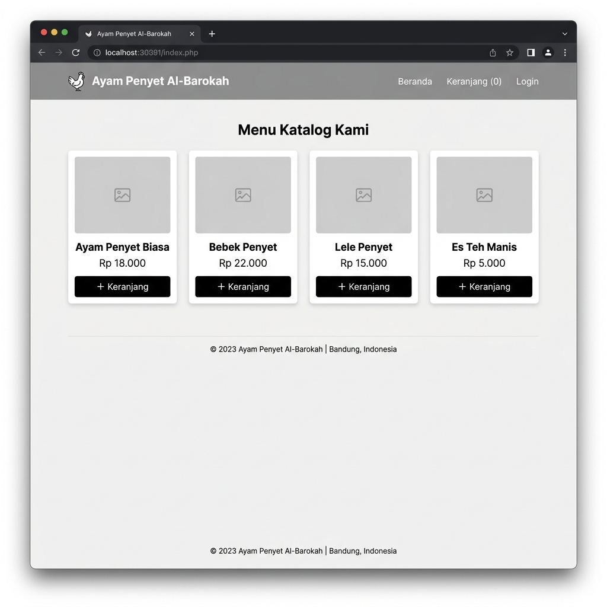
*Gambar 4. 13 Halaman Utama Katalog*

2. Halaman Keranjang Belanja (keranjang.php)
Halaman ini digunakan oleh pelanggan untuk meninjau kembali daftar makanan dan minuman yang telah dipilih sebelum bertransaksi. Halaman ini menyajikan tabel item belanjaan lengkap dengan kuantitas porsi yang dapat diubah (+/-), subtotal harga per menu, dan tombol navigasi untuk mengarahkan pengguna ke formulir pemesanan (*checkout*).

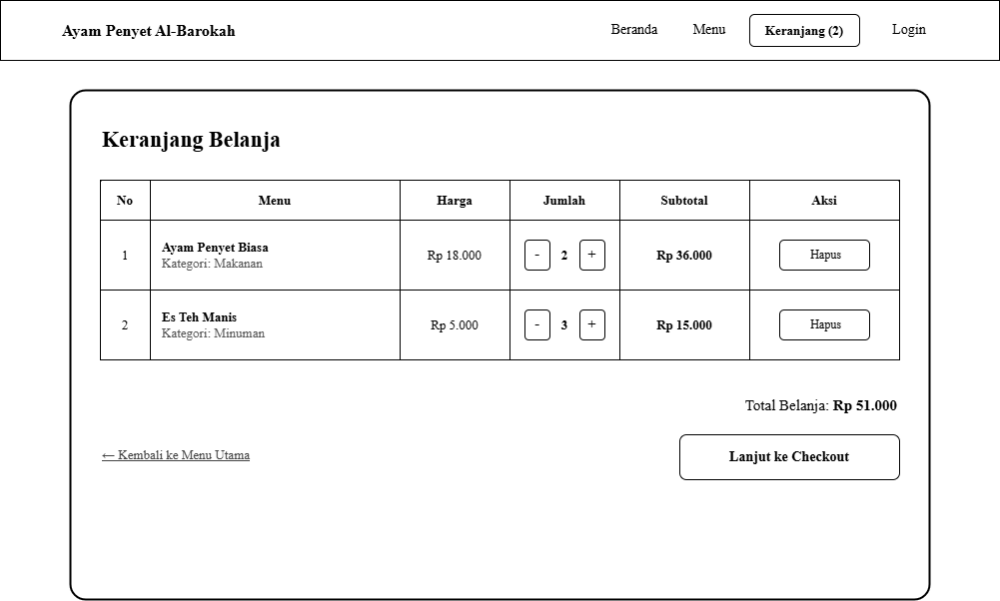
*Gambar 4. 14 Halaman Keranjang Belanja*

3. Halaman Formulir Checkout (checkout.php)
Halaman ini memfasilitasi pengisian identitas pengiriman transaksi. Pelanggan diwajibkan mengisi nama lengkap, nomor telepon, dan metode pengambilan pesanan (*dine in*, *take away*, atau *delivery*). Jika opsi pengiriman (*delivery*) dipilih, sistem secara otomatis akan memunculkan isian alamat pengantaran dan menambahkan ongkos kirim flat Rp10.000 ke dalam total tagihan belanja.

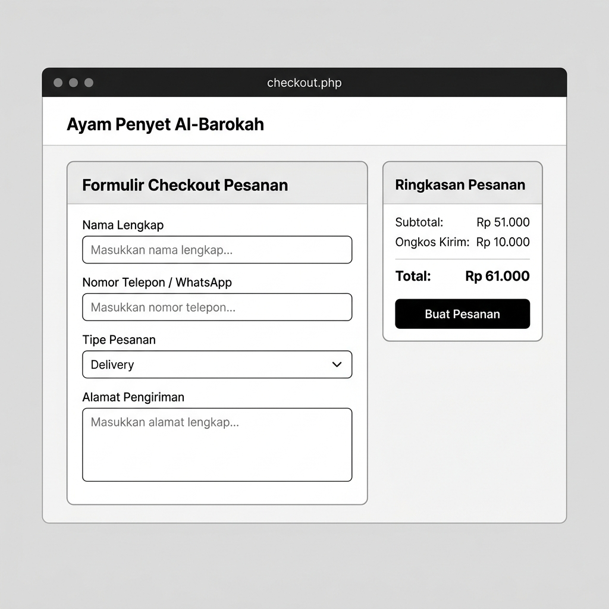
*Gambar 4. 15 Halaman Formulir Checkout*

4. Halaman Konfirmasi & Unggah Bukti Bayar (konfirmasi-bayar.php)
Halaman ini merupakan halaman penyelesaian transaksi. Halaman ini menampilkan total nominal tagihan akhir, instruksi nomor tujuan transfer (Platform DANA & SeaBank), kolom formulir untuk mengunggah berkas foto bukti transfer pembayaran, serta status pelacakan pesanan secara *real-time* dari dapur.

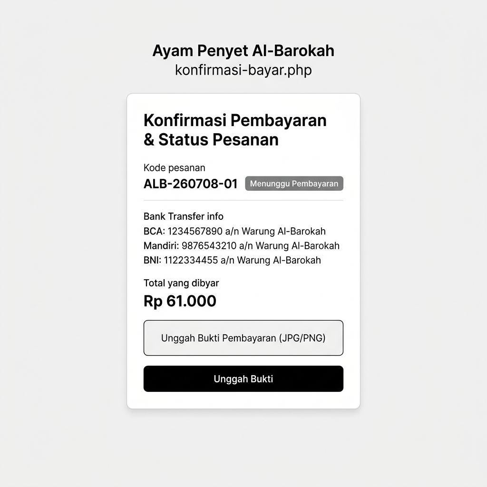
*Gambar 4. 16 Halaman Konfirmasi & Unggah Bukti Bayar*

5. Halaman Login (login.php)
Halaman ini merupakan pintu utama masuk ke Sistem Pemesanan Online Ayam Penyet Al-Barokah. Pengguna diwajibkan mengisi kolom *username* dan *password* sesuai akun yang telah terdaftar. Sistem secara otomatis akan memverifikasi data login dan mengarahkan pengguna ke halaman yang sesuai dengan perannya, yaitu panel dashboard admin (untuk peran admin) atau halaman dashboard pelanggan (untuk peran pelanggan).

Rancangan antarmuka halaman login dirancang menggunakan konsep terpusat (*centered card layout*) dan bergaya hitam-putih (*grayscale*) dengan tipe huruf *Times New Roman*. Tampilan rancangan antarmuka login dapat dilihat pada Gambar 4.17.

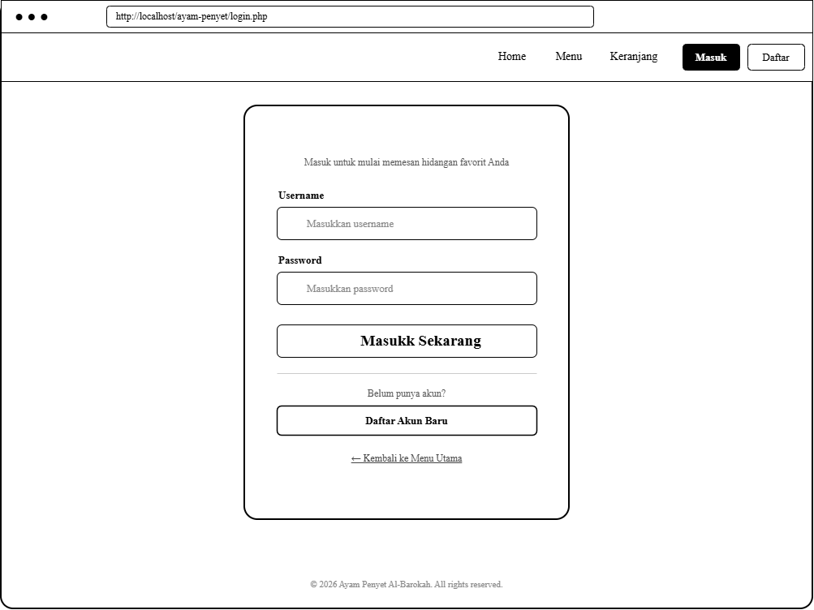
*Gambar 4. 17 Rancangan Antarmuka Halaman Login*

Deskripsi dari setiap komponen pembentuk antarmuka halaman login pada Gambar 4.17 dijelaskan secara detail pada Tabel 4.15.

<table border="1" cellpadding="8" cellspacing="0" style="border-collapse: collapse; width: 100%; font-family: 'Times New Roman', Times, serif; font-size: 11pt; border: 1px solid #000000; color: #000000;">
  <thead>
    <tr style="background-color: #f2f2f2;">
      <th style="width: 8%; font-weight: bold; text-align: center; border: 1px solid #000000;">No</th>
      <th style="width: 25%; font-weight: bold; text-align: left; border: 1px solid #000000;">Nama Elemen</th>
      <th style="width: 20%; font-weight: bold; text-align: left; border: 1px solid #000000;">Jenis Elemen</th>
      <th style="width: 47%; font-weight: bold; text-align: left; border: 1px solid #000000;">Fungsi dan Keterangan</th>
    </tr>
  </thead>
  <tbody>
    <tr>
      <td style="text-align: center; border: 1px solid #000000;">1</td>
      <td style="border: 1px solid #000000;"><b>Browser Frame &amp; URL</b></td>
      <td style="border: 1px solid #000000;">Container Window</td>
      <td style="border: 1px solid #000000;">Mensimulasikan bingkai peramban web dengan alamat menuju berkas login sistem pada <code>http://localhost/ayam-penyet/login.php</code>.</td>
    </tr>
    <tr>
      <td style="text-align: center; border: 1px solid #000000;">2</td>
      <td style="border: 1px solid #000000;"><b>Header Menu &amp; Brand</b></td>
      <td style="border: 1px solid #000000;">Navigation Bar</td>
      <td style="border: 1px solid #000000;">Menampilkan logo brand (🔥) beserta tautan navigasi statis (Home, Menu, Keranjang, Masuk, Daftar) sebelum sesi login aktif.</td>
    </tr>
    <tr>
      <td style="text-align: center; border: 1px solid #000000;">3</td>
      <td style="border: 1px solid #000000;"><b>Card Panel</b></td>
      <td style="border: 1px solid #000000;">Container Box</td>
      <td style="border: 1px solid #000000;">Kotak pembungkus formulir utama berlatar putih dengan border hitam tebal untuk memusatkan fokus visual pengguna.</td>
    </tr>
    <tr>
      <td style="text-align: center; border: 1px solid #000000;">4</td>
      <td style="border: 1px solid #000000;"><b>Input Username</b></td>
      <td style="border: 1px solid #000000;">Text Input Box</td>
      <td style="border: 1px solid #000000;">Kolom untuk menginput username pengguna dengan petunjuk teks (*placeholder*) awal "Masukkan username".</td>
    </tr>
    <tr>
      <td style="text-align: center; border: 1px solid #000000;">5</td>
      <td style="border: 1px solid #000000;"><b>Input Password</b></td>
      <td style="border: 1px solid #000000;">Password Input Box</td>
      <td style="border: 1px solid #000000;">Kolom terproteksi untuk menginput kata sandi akun dengan petunjuk teks (*placeholder*) awal "Masukkan password".</td>
    </tr>
    <tr>
      <td style="text-align: center; border: 1px solid #000000;">6</td>
      <td style="border: 1px solid #000000;"><b>Tombol Masuk Sekarang</b></td>
      <td style="border: 1px solid #000000;">Submit Button</td>
      <td style="border: 1px solid #000000;">Tombol hitam pekat untuk mengirim data kredensial formulir login ke basis data untuk divalidasi.</td>
    </tr>
    <tr>
      <td style="text-align: center; border: 1px solid #000000;">7</td>
      <td style="border: 1px solid #000000;"><b>Tombol Daftar Akun</b></td>
      <td style="border: 1px solid #000000;">Button Link</td>
      <td style="border: 1px solid #000000;">Tombol dengan border tipis untuk mengalihkan pelanggan baru ke form registrasi akun (<code>register.php</code>).</td>
    </tr>
    <tr>
      <td style="text-align: center; border: 1px solid #000000;">8</td>
      <td style="border: 1px solid #000000;"><b>Tautan Kembali</b></td>
      <td style="border: 1px solid #000000;">Hyperlink</td>
      <td style="border: 1px solid #000000;">Link "← Kembali ke Menu Utama" untuk keluar dari halaman login dan kembali ke beranda katalog umum.</td>
    </tr>
  </tbody>
</table>

6. Halaman Dashboard Admin (admin/index.php)
Halaman ini merupakan antarmuka panel administrasi utama yang diakses setelah pengguna dengan hak akses admin berhasil masuk. Halaman ini menyajikan rekapitulasi data statistik performa keuangan dan operasional warung secara *real-time*, seperti total pendapatan bersih lunas, jumlah antrean order masuk, status pengerjaan dapur, serta tabel rangkuman 5 transaksi pesanan terbaru.

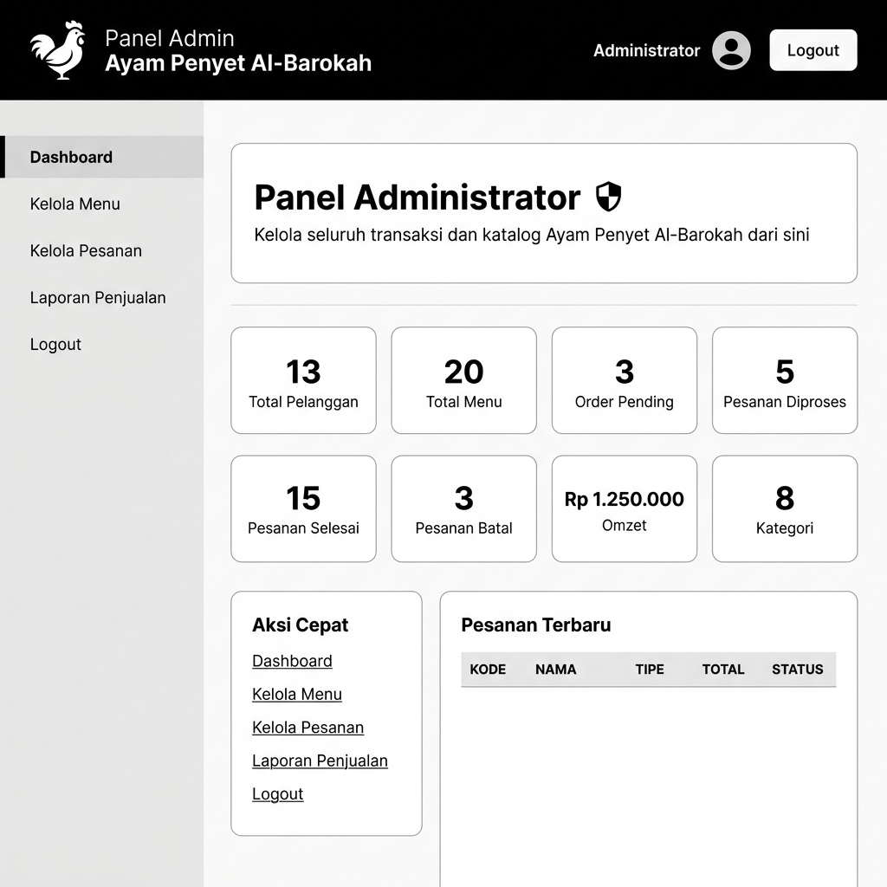
*Gambar 4. 18 Halaman Dashboard Admin*

7. Halaman Kelola Data Menu (admin/kelola_menu.php)
Halaman ini memfasilitasi admin untuk mengelola katalog menu makanan dan minuman yang dijual. Admin dapat menambah menu baru, memperbarui informasi harga, mengunggah foto menu, serta menonaktifkan status menu jika stok hidangan di dapur telah habis.

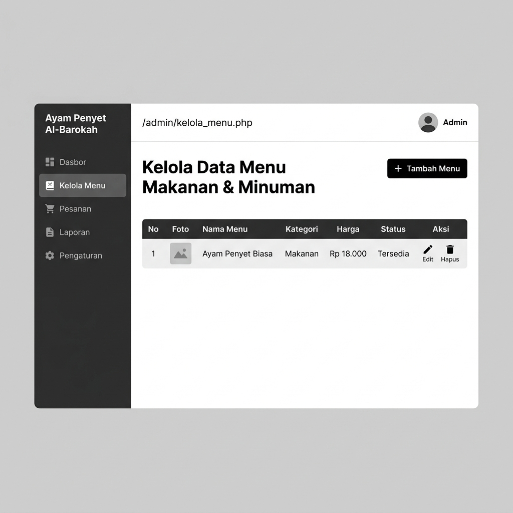
*Gambar 4. 19 Halaman Kelola Data Menu*

8. Halaman Kelola Data Transaksi (admin/kelola_pesanan.php)
Halaman ini digunakan oleh admin untuk mengelola pesanan masuk dari pelanggan secara terpadu. Admin dapat meninjau detail order, memverifikasi file bukti transfer bank, mengubah status pembayaran menjadi lunas/ditolak, serta meng-update status pemrosesan hidangan dapur.

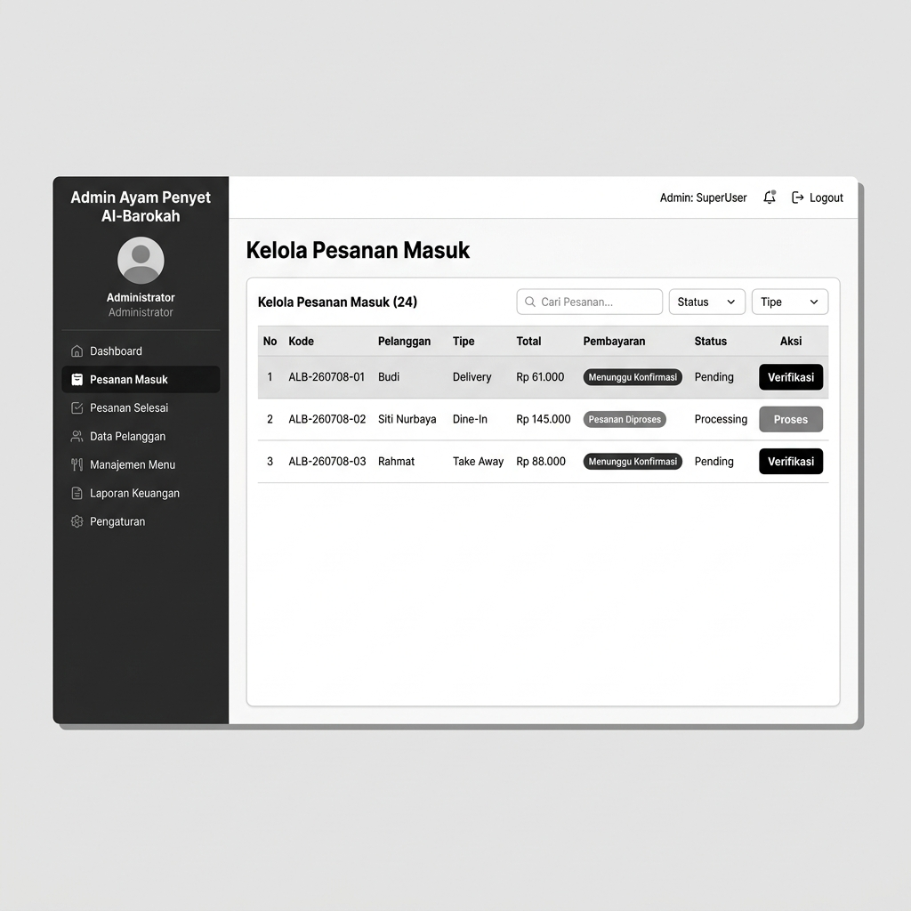
*Gambar 4. 20 Halaman Kelola Data Transaksi*

9. Halaman Rekap Laporan Keuangan (admin/laporan.php)
Halaman ini memfasilitasi penarikan rekapitulasi omzet penjualan outlet. Admin dapat memfilter laporan penjualan berdasarkan rentang tanggal awal dan akhir, serta mencetak dokumen laporan rekapitulasi penjualan fisik secara langsung melalui printer.

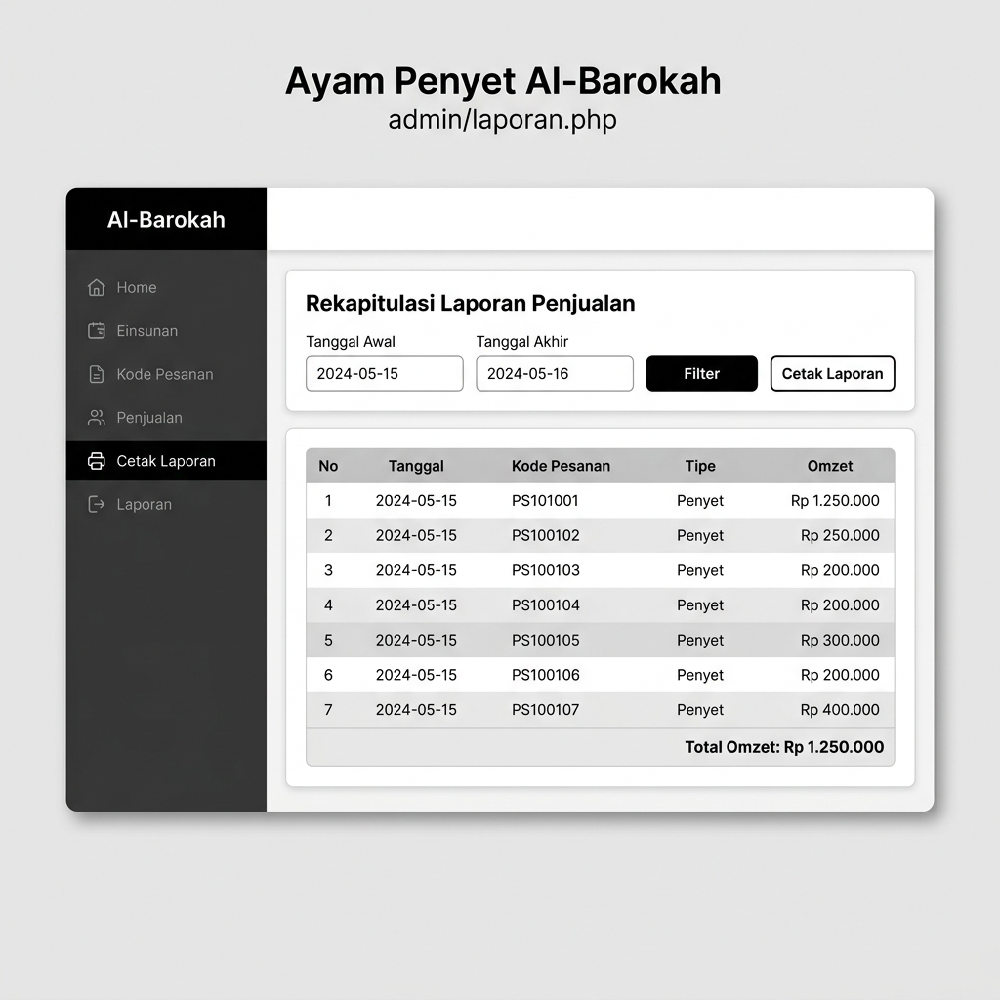
*Gambar 4. 21 Halaman Rekap Laporan Keuangan*Laporan Keuangan
